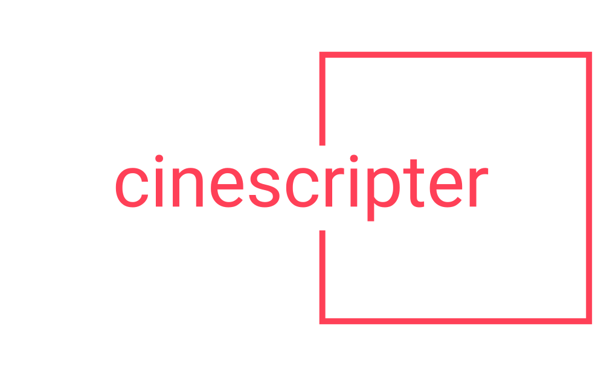

  

    <em>CineScripter, supports your community, by enabling you to automatically create video content based own data</em>

---

**Source Code**: <a href="https://github.com/Tibiritabara/cinescripter" target="_blank">https://github.com/Tibiritabara/cinescripter</a>

---

CineScripter is a modern application, to generate video content based on your own data, harnessing the power of third parties for voice generation, multimedia generation, and text generation

The key features are:
* **Engaging**: Gathers fun images and gifs images, relevant to the script, to keep the audience engaged
* **Customizable**: Generate voice from this Text-To-Speech third party to successfully narrate your content
* **Context-based**: Generate a video script based on your own content and data
* **Extensible**: Quickly add new generation capabilities to add your own flavor to the content

## Requirements

Python 3.7+

CineScripter harnesses bespoke solutions for content generation:

* <a href="https://platform.openai.com/">OpenAI for the script generation</a>
* <a href="https://www.unsplash.com/">Unsplash for relevant media</a>
* <a href="https://developers.giphy.com/">Giphy for engaging media</a>
* <a href="https://beta.elevenlabs.io/">ElevenLabs for TTS</a>
* <a href="https://weaviate.io" >Weaviate for Vector storage needs</a>

Please ensure having **API keys** for Giphy, ElevenLabs, OpenAI, and Weaviate. For more details on which API keys are needed, please check the `./config/.env.dist` file.

